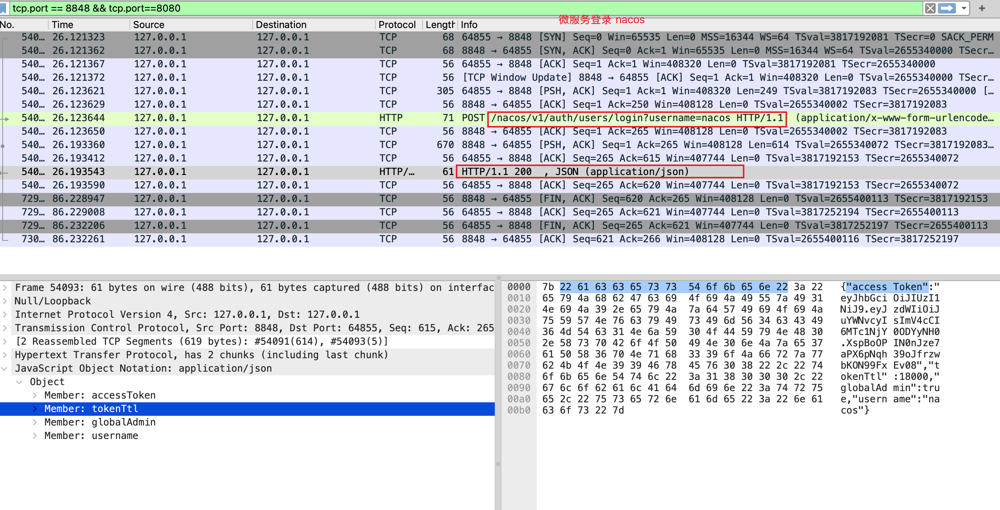
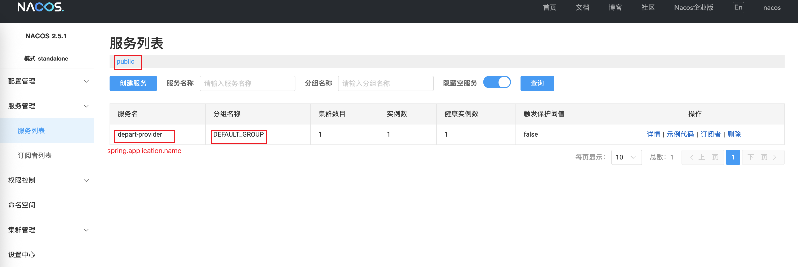
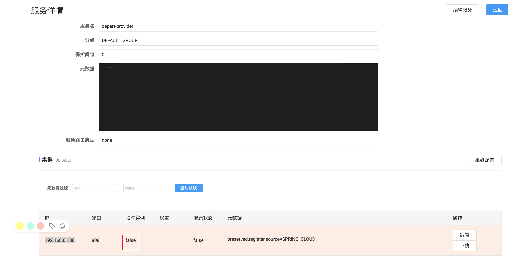

# Getting Started

1. [QWEN jpa config](https://chat.qwen.ai/c/40b181ca-5bd3-41e3-8fc8-8a7ec65aa40d)

# nacos 截图






# nacos 临时实例，持久实例

1. 临时实例 客户端发心跳
2. 持久实例 服务端主动检测

# 一旦被注册为临时实例，不可被改为持久实例

1.报错

```
Caused by: com.alibaba.nacos.api.exception.NacosException: failed to req API:/nacos/v1/ns/instance after all servers([localhost:8848]) tried: errCode: 400, errMsg: Current service DEFAULT_GROUP@@depart-provider is ephemeral service, can't register persistent instance. 
	at com.alibaba.nacos.client.naming.remote.http.NamingHttpClientProxy.reqApi(NamingHttpClientProxy.java:410)
	at com.alibaba.nacos.client.naming.remote.http.NamingHttpClientProxy.reqApi(NamingHttpClientProxy.java:351)
	at com.alibaba.nacos.client.naming.remote.http.NamingHttpClientProxy.reqApi(NamingHttpClientProxy.java:346)
	at com.alibaba.nacos.client.naming.remote.http.NamingHttpClientProxy.registerService(NamingHttpClientProxy.java:153)
	at com.alibaba.nacos.client.naming.remote.NamingClientProxyDelegate.registerService(NamingClientProxyDelegate.java:98)
	at com.alibaba.nacos.client.naming.NacosNamingService.registerInstance(NacosNamingService.java:143)
	at com.alibaba.cloud.nacos.registry.NacosServiceRegistry.register(NacosServiceRegistry.java:75)
	... 25 common frames omitted
```
2.解决方案
    1. 换一个新的服务名称
    2. 删除该服务的 nacos 的配置
```bash
yang@bogon ~/nacos/naming/public
$ ls
DEFAULT_GROUP%40%40depart-consumer	DEFAULT_GROUP%40%40depart-provider	failover
yang@bogon ~/nacos/naming/public
$ rm -rf DEFAULT_GROUP%40%40depart-provider
```
3. 删除 nacos 持久实例，页面删不掉
```bash
curl -d 'serviceName=depart-provider' \
-d 'ip=192.168.0.100' \
-d 'port=8081' \
-d 'ephemeral=false' \
-d 'username=nacos' \
-d 'password=nacos' \
X DELETE 'http://127.0.0.1:8848/nacos/v2/ns/instance'
```


# nacos 配置外部存储 mysql

1. /conf/mysql.schema.sql
2. 修改配置
```
      #*************** Config Module Related Configurations ***************#
### If use MySQL as datasource:
### Deprecated configuration property, it is recommended to use `spring.sql.init.platform` replaced.
spring.datasource.platform=mysql
spring.sql.init.platform=mysql

### Count of DB:
db.num=1

### Connect URL of DB:
db.url.0=jdbc:mysql://127.0.0.1:3306/nacos_config?characterEncoding=utf8&connectTimeout=1000&socketTimeout=3000&autoReconnect=true&useUnicode=true&useSSL=false&serverTimezone=Asia/Shanghai
db.user.0=root
db.password.0=password
```
3. 重启 nacos

